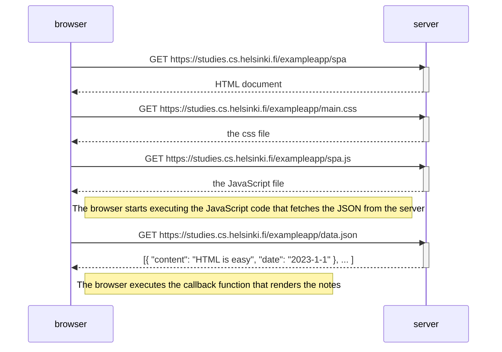
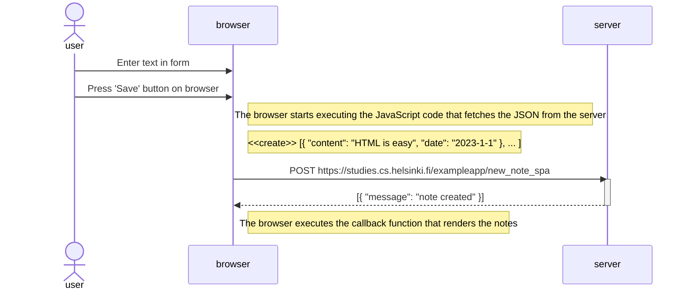

# Load Notes

```mermaid
sequenceDiagram
    participant browser
    participant server

    browser->>server: GET https://studies.cs.helsinki.fi/exampleapp/spa
    activate server
    server-->>browser: HTML document
    deactivate server

    browser->>server: GET https://studies.cs.helsinki.fi/exampleapp/main.css
    activate server
    server-->>browser: the css file
    deactivate server

    browser->>server: GET https://studies.cs.helsinki.fi/exampleapp/spa.js
    activate server
    server-->>browser: the JavaScript file
    deactivate server

    Note right of browser: The browser starts executing the JavaScript code that fetches the JSON from the server

    browser->>server: GET https://studies.cs.helsinki.fi/exampleapp/data.json
    activate server
    server-->>browser: [{ "content": "HTML is easy", "date": "2023-1-1" }, ... ]
    deactivate server

    Note right of browser: The browser executes the callback function that renders the notes
```

___

## Add New Note

```mermaid
sequenceDiagram
    actor user  
    participant browser
    participant server

    user->>browser: Enter text in form
    user->>browser: Press 'Save' button on browser
    Note right of browser: The browser starts executing the JavaScript code that fetches the JSON from the server
    Note right of browser: <<create>> [{ "content": "HTML is easy", "date": "2023-1-1" }, ... ] 
    browser->>server: POST https://studies.cs.helsinki.fi/exampleapp/new_note_spa
    activate server
    server-->>browser: [{ "message": "note created" }] 
    deactivate server
    Note right of browser: The browser executes the callback function that renders the notes


```
